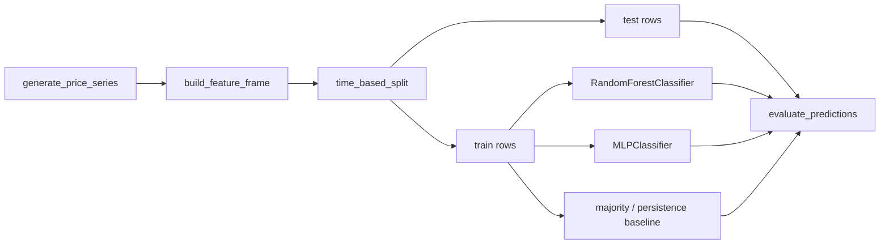

# Architecture

## Why the data is synthetic

Real price history needs either a paid data vendor or a network call this environment cannot make reliably or reproducibly. `generate_price_series` builds a price path with a known, tunable amount of autocorrelation instead: enough signal that the prediction task is learnable, not so much that it is unrealistically easy. Because the generating process is known, the experiment can ask an honest question — "do these models recover the structure that is actually there?" — instead of an unanswerable one about real markets.

## Why the baselines are in the same comparison as the models

`majority_baseline` and `persistence_baseline` cost nothing to compute and are what any model has to justify its complexity against. In `scripts/run_experiment.py`'s default configuration, the persistence baseline — "tomorrow continues today's direction" — actually **matches or beats** both learned models. That is not a bug: the synthetic series is generated as `return[t] = momentum_strength * return[t-1] + noise`, which means today's return sign already is close to the optimal one-step predictor, and the extra features available to the learned models mostly add noise on top of a signal a two-line heuristic already captures. A real evaluation that only reported the fancier model's number would have hidden that.

## Why the train/test split is chronological, not random

`time_based_split` takes the first `1 - test_fraction` of rows for training and the rest for testing, in order. A random split would let the model train on rows that come after some of its test rows in time, which no real deployment could ever do — the resulting accuracy would be real, but it would be answering a different, easier question than the one that matters.

## Why there is no PyTorch or Keras here

The roadmap names PyTorch or Keras as the neural network option; this repository uses scikit-learn's `MLPClassifier` instead. For a handful of engineered tabular features and a few thousand rows, a small multi-layer perceptron is the right amount of model, and it keeps the whole pipeline on one dependency with no GPU expectation and no multi-hundred-megabyte install, which also kept this repository buildable and testable in the same lightweight way as the rest of the portfolio.
